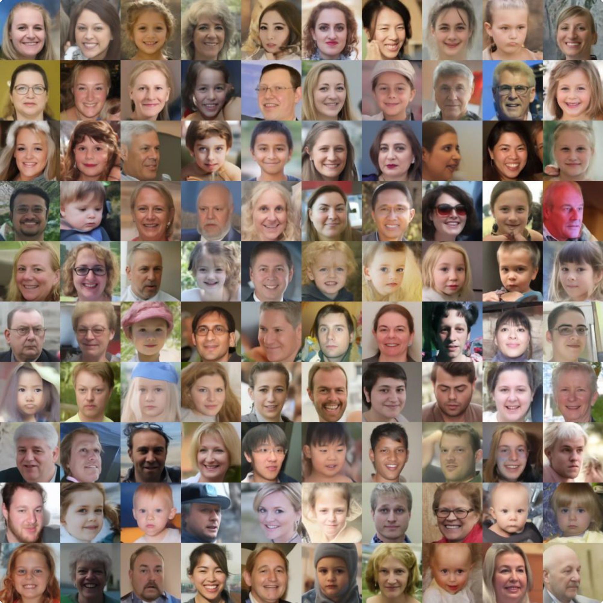

# ProgDiffusion: Progressively Self-encoding Diffusion Models


## Dataset

We use the LMDB ready-to-use datasets provided by Diff-AE ([https://github.com/phizaz/diffae#lmdb-datasets](https://github.com/phizaz/diffae#lmdb-datasets)).

The directory structure should be:

```
data
├─horse
|   ├─data.mdb
|   └lock.mdb
├─ffhq
|  ├─data.mdb
|  └lock.mdb
├─celebahq
|    ├─CelebAMask-HQ-attribute-anno.txt
|    ├─data.mdb
|    └lock.mdb
├─celeba64
|    ├─data.mdb
|    └lock.mdb
├─bedroom
|    ├─data.mdb
|    └lock.mdb
```


## Install Requirements
```
pip install -r requirements.txt
```


## Training

To train ProgDiffusion, run this command:

```
python run_ffhq128.py
```


## Representation Learning

### Unconditional Generation including FID

```
python run_ffhq128.py
```

<div align=center></div>


### Interpolation


```
python inter.py
```

<div align=center></div>

### Time-specific Sematic Encoding


```
python time.py
```

<div align=center></div>


### Disentanglement

```
python disen.py
```

<div align=center></div>

### TAD
```
python dis_num.py
```

### Attribute manipulation

```
python attr.py
```

<div align=center></div>